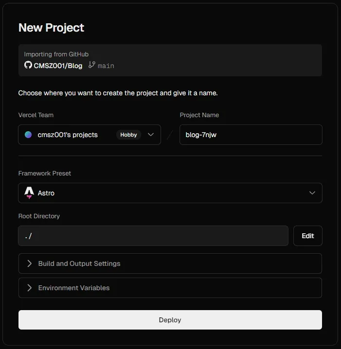

::github{repo="saicaca/fuwari"}

## 准备的东西

1. 聪明的脑子，不会的先搜索，搜索不到就~~去和AI调情~~。

2. 版本控制系统（[Git](https://git-scm.com/)），也可以使用[Github Desktop](https://github.com/apps/desktop)。

3. Fuwari的初始化和预览需要[Node.js — Run JavaScript Everywhere](https://nodejs.org/zh-cn)。

4. Markdown编辑器，例如[Visual Studio Code](https://code.visualstudio.com/)、[marktext](https://github.com/marktext/marktext)等。

5. 一个Git远程仓库，例如[Github](https://github.com/)、[GitLab](https://gitlab.com/)等（可选）

6. PaaS平台，例如[Netlify](https://www.netlify.com/)、[Vercel](https://vercel.com/)等（可选）

## 让我们开始吧

### 🚀 使用方法 1

使用 [create-fuwari](https://github.com/L4Ph/create-fuwari) 在本地初始化项目。

```shell
# npm
npm create fuwari@latest

# yarn
yarn create fuwari

# pnpm
pnpm create fuwari@latest

# bun
bun create fuwari@latest

# deno
deno run -A npm:create-fuwari@latest
```

1. 通过配置文件 `src/config.ts` 自定义博客
2. 执行 `pnpm new-post <filename>` 创建新文章，并在 `src/content/posts/` 目录中编辑
3. 参考[官方指南](https://docs.astro.build/zh-cn/guides/deploy/)将博客部署至 Vercel, Netlify, GitHub Pages 等；部署前需编辑 `astro.config.mjs` 中的站点设置。

### 🚀 使用方法 2

1. 使用此模板[生成新仓库](https://github.com/saicaca/fuwari/generate)或 Fork 此仓库
2. 进行本地开发，Clone 新的仓库，执行 `pnpm install` 和 `pnpm add sharp` 以安装依赖
   - 若未安装 [pnpm](https://pnpm.io/)，执行 `npm install -g pnpm`
3. 通过配置文件 `src/config.ts` 自定义博客
4. 执行 `pnpm new-post <filename>` 创建新文章，并在 `src/content/posts/` 目录中编辑
5. 参考[官方指南](https://docs.astro.build/zh-cn/guides/deploy/)将博客部署至 Vercel, Netlify, GitHub Pages 等；部署前需编辑 `astro.config.mjs` 中的站点设置。

## 修改配置文件

1. astro.config.mjs
   
   请自行阅读[Astro 配置文件](https://docs.astro.build/zh-cn/reference/configuration-reference/)

2. src\config.ts（其他的请自行翻译注释）
   
   - title：博客主标题
   
   - subtitle：博客副标题，会显示为`title - subtitle`
   
   - lang：博客的语言，支持`'en', 'zh-CN', 'zh_TW', 'ja', 'ko', 'es', 'th', 'vi'`等
   
   - themeColor
     
     - hue：博客主题色`主题颜色的默认色调，范围从 0 到 360。例如，红色：0，青色：200，青蓝色：250，粉色：345`
     
     - fixed：是否隐藏主题颜色选择器给访客

> 引用自 [Fuwari静态博客搭建教程 - AcoFork Blog](https://2x.nz/posts/fuwari/#%E6%94%B9%E5%86%99fuwari%E7%9A%84%E5%9F%BA%E6%9C%AC%E4%BF%A1%E6%81%AF%E5%B9%B6%E4%B8%94%E6%B8%85%E7%90%86%E5%A4%9A%E4%BD%99%E6%96%87%E4%BB%B6)
> 
> - banner：src：即banner图片，支持http/https URL
> 
> - favicon：src：即网站图标，支持http/https URL
> 
> - links：即友情链接，这些链接在导航栏上
> 
> - avatar：即你的头像
> 
> - name：即你的名字
> 
> - bio：即个性签名，会显示在头像和名字下面
> 
> - `NavBarConfig` 为导航栏设置的超链接。`ProfileConfig` 为你的用户的超链接
> 
> - icon：你需要前往[icones.js.org](https://icones.js.org/)去搜索你想要的图标，比如QQ，则填写 `fa6-brands:qq` ，如图。Fuwari默认支持这几种类型：`fa6-brands`, `fa6-regular`, `fa6-solid`, `material-symbols`。可以在 `astro.config.mjs` 中搜索关键字进行配置


## 部署到PaaS平台

部署的前提已推送到远程仓库

### Vercel

> 可参考[部署你的 Astro 站点至 Vercel | Docs](https://docs.astro.build/zh-cn/guides/deploy/vercel/)

1. 向Astro 项目中添加 [Vercel 适配器](https://docs.astro.build/zh-cn/guides/integrations-guide/vercel/) 以开启 [按需渲染](https://docs.astro.build/zh-cn/guides/on-demand-rendering/)。

2. 打开[Vercel](https://vercel.com/dashboard)并创建项目


3. 构建静态页面



---

🎉 恭喜你，你的Astro+Fuwari博客已部署完成
