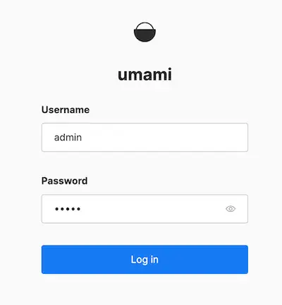
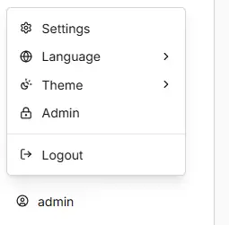
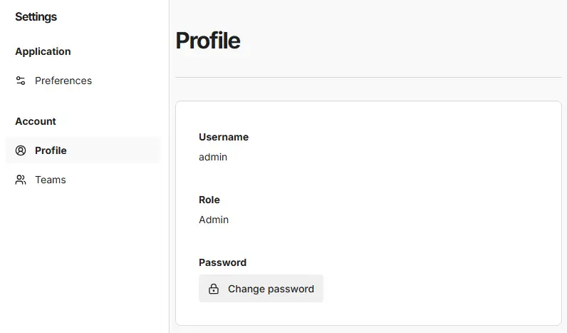
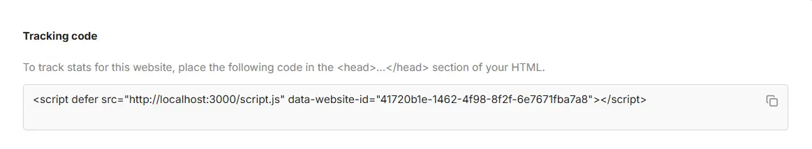

::github{repo="umami-software/umami"}

## 准备的东西
1. 一台能运行Docker Compose的服务器
2. 良好的网络环境

## 安装 Docker
运行
```shell
bash <(curl -sSL https://linuxmirrors.cn/docker.sh)
```
并按照指示安装 Docker

## 部署 Umami
1. 创建运行文件夹
```shell
mkdir /path/to/umami/ && cd /path/to/umami/
```
2. 创建 Docker Compose 文件
```shell
touch compose.yml
```
然后使用文本编辑器`nano`或 `vim`将下方代码填入 compose.yml
```yaml title="compose.yml"
services:
  umami:
    image: ghcr.nju.edu.cn/umami-software/umami:latest
    container_name: umami
    ports:
      - "3000:3000"
    environment:
      DATABASE_URL: postgresql://umami:umami@db:5432/umami
      APP_SECRET: replace-me-with-a-random-string
    depends_on:
      db:
        condition: service_healthy
    init: true
    restart: always
    healthcheck:
      test: ["CMD-SHELL", "curl http://127.0.0.1:23000/api/heartbeat"]
      interval: 5s
      timeout: 5s
      retries: 5
  db:
    image: postgres:15-alpine
    container_name: umami-db
    environment:
      POSTGRES_DB: umami
      POSTGRES_USER: umami
      POSTGRES_PASSWORD: umami
    volumes:
      - ./umami-db-data:/var/lib/postgresql/data
    restart: always
    healthcheck:
      test: ["CMD-SHELL", "pg_isready -U $${POSTGRES_USER} -d $${POSTGRES_DB}"]
      interval: 5s
      timeout: 5s
      retries: 5
volumes:
  umami-db-data:
```
其中的`APP_SECRET`可以使用[Credentials Generator | LibreChat](https://www.librechat.ai/docs/toolkit/credentials-generator)生成后的`JWT_SECRET`里的内容或使用以下命令生成一个：
```shell
openssl rand -hex 32
```
3. 🚀启动
```shell
docker compose up -d
```

## 登录后台
访问[127.0.0.1:3000](http://127.0.0.1:3000)并使用默认的账户信息登录：
- 账号：admin
- 密码：umami

登录后，点击侧边导航栏中的个人资料按钮，然后点击`Settings`。

接着导航至`Profile`并点击 `Change password` 按钮。


## 添加站点
1. 访问[/websites](http://127.0.0.1:3000/websites)
2. 点击`添加网站`的按钮，然后填写`名字`和`域名`
3. 点击`编辑`，将跟踪代码填写到网站的`<head>`内


## 配置
通过在`/path/to/umami/`创建`.env`文件或修改`compose.yml`中的`environment`去修改配置，参考[Environment variables](https://docs.umami.is/docs/environment-variables)，下方是一些配置
> ### APP_SECRET `v1.0.0`
> 
> 用于保护身份验证令牌的随机字符串。每个安装实例都应有一个唯一值。你可以使用以下命令生成一个：
> 
> ```shell
> openssl rand -hex 32
> ```
> 
> ```
> APP_SECRET = "random string"
> ```
> 
> ### CLIENT_IP_HEADER `v1.24.0`
> 
> 用于检查客户端 IP 地址的 HTTP 头。当你位于使用非标准头的代理之后时，此变量很有用。
> 
> ```
> CLIENT_IP_HEADER = "header name"
> ```
> 
> ### COLLECT_API_ENDPOINT `v1.34.0`
> 
> 允许你将指标发送到与默认 `/api/send` 不同的位置。这有助于规避某些广告拦截器。
> 
> ```
> COLLECT_API_ENDPOINT = "/my-custom-route"
> ```
> 
> ### CORS_MAX_AGE `v2.0.0`
> 
> CORS 预检请求的缓存时间（秒）。默认为 24 小时。
> 
> ```
> CORS_MAX_AGE = 86400
> ```
> 
> ### DATABASE_URL `v1.0.0`
> 
> ```
> DATABASE_URL = "connection string"
> ```
> 
> 数据库的连接字符串。这是唯一必需的变量。
> 
> ### DEBUG `v2.0.0`
> 
> 针对应用程序特定区域的日志输出。可选值包括 `umami:auth`、`umami:clickhouse`、`umami:kafka`、`umami:middleware` 和 `umami:prisma`。
> 
> ```
> DEBUG = "umami:*"
> ```
> 
> ### DISABLE_BOT_CHECK `v2.0.0`
> 
> 默认情况下，机器人流量会被排除在统计之外。此变量用于禁用机器人检测。
> 
> ```
> DISABLE_BOT_CHECK = 1
> ```
> 
> ### DISABLE_LOGIN `v1.26.0`
> 
> 禁用应用程序的登录页面。
> 
> ```
> DISABLE_LOGIN = 1
> ```
> 
> ### DISABLE_UPDATES `v1.33.0`
> 
> 禁用对 Umami 新版本的检查。
> 
> ```
> DISABLE_UPDATES = 1
> ```
> 
> ### DISABLE_TELEMETRY `v2.0.0`
> 
> Umami 会收集完全匿名的遥测数据以帮助改进应用程序。如果你不想参与，可以选择禁用此功能。
> 
> ```
> DISABLE_TELEMETRY = 1
> ```
> 
> ### ENABLE_TEST_CONSOLE `v2.0.0`
> 
> 启用内部测试页面 `{host}/console`。需要管理员权限。用户可以在该页面向其网站手动触发页面浏览和事件。
> 
> ```
> ENABLE_TEST_CONSOLE = 1
> ```
> 
> ### FAVICON_URL `v2.18.0`
> 
> 用于显示网站图标的服务 URL。
> 
> ```
> FAVICON_URL = "service URL"
> ```
> 
> 默认为 `icons.duckduckgo.com`：
> 
> - `https://icons.duckduckgo.com/ip3/{{domain}}.ico`（中国大陆访问不佳）
> 
> 你可以使用以下备选方案：
> 
> - `https://www.google.com/s2/favicons?domain={{domain}}`
> - `https://logo.clearbit.com/{{domain}}`
> - `https://favicon.im/{{domain}}`
> 
> ### GEO_DATABASE_URL `v2.0.0`
> 
> 用于下载 MaxMind 兼容的 MMDB 格式 GeoIP 数据库的 URL。当来自 CDN 的位置头不可用时，用于基于 IP 的位置检测。
> 
> ```
> GEO_DATABASE_URL = "https://example.com/GeoLite2-City.mmdb"
> ```
> 
> ### HOSTNAME / PORT `v1.0.0`
> 
> 如果你运行的环境要求绑定到特定的主机名或端口（例如 Heroku），你可以添加这些变量，并使用 `npm run start-env` 而非 `npm start` 来启动应用。
> 
> ```
> HOSTNAME = "my.hostname.com"
> PORT = 3000
> ```
> 
> ### IGNORE_IP `v1.0.0`
> 
> 你可以提供一个以逗号分隔的 IP 地址和 CIDR 范围列表，以将其排除在数据收集之外。
> 
> ```
> IGNORE_IP = "192.168.0.1, 10.0.0.0/24, 2001:db8::/32"
> ```
> 
> ### LOG_QUERY `v2.0.0`
> 
> 如果你在开发模式下运行，此变量会将数据库查询记录到控制台以供调试。
> 
> ```
> LOG_QUERY = 1
> ```
> 
> ### PRIVATE_MODE `v2.11.0`
> 
> 禁用所有外部网络调用。请注意，由于网站图标来自 duckduckgo.com，此操作也会禁用所有网站图标。
> 
> ```
> PRIVATE_MODE = 1
> ```
> 
> ### REMOVE_TRAILING_SLASH `v1.26.0`
> 
> 移除所有传入 URL 末尾的斜杠。
> 
> ```
> REMOVE_TRAILING_SLASH = 1
> ```
> 
> ### TRACKER_SCRIPT_NAME `v1.26.0`
> 
> 允许你为跟踪脚本指定一个自定义名称，以区别于默认的 `script.js`。这有助于规避某些广告拦截器。
> 
> 不需要 `.js` 扩展名。该值也可以是你选择的任何路径，例如 `/path/to/tracker`。
> 
> ```
> TRACKER_SCRIPT_NAME = "custom-script-name.js"
> ```
> 
> ### SKIP_LOCATION_HEADERS `v2.15.0`
> 
> 跳过使用已知的位置头进行国家/地区/城市检测，强制使用本地 Geo 数据库。
> 
> 这在代理或 CDN 仅设置了国家（不含地区或城市）头的环境中很有用（例如当 Cloudflare 的 Network > IP Geolocation 开关打开时，仅提供 `CF-IPCountry` 头）。
> 
> ```
> SKIP_LOCATION_HEADERS = 1
> ```
> 
> ### ALLOWED_FRAME_URLS `v2.3.0`
> 
> 一个以空格分隔的 URL 列表，允许其在 iframe 中托管该应用程序。
> 
> ```
> ALLOWED_FRAME_URLS = "URLs"
> ```
> 
> ### BASE_PATH `v1.9.0`
> 
> 如果你想将 Umami 托管在子目录下，请设置此变量。你可能需要更新反向代理设置以正确处理 BASE_PATH 前缀。
> 
> ```
> BASE_PATH = "/custom"
> ```
> 
> ### DATABASE_TYPE `v2.0.0`
> 
> ```
> DATABASE_TYPE = "postgresql"
> ```
> 
> 要使用的数据库类型。仅 Docker 构建时需要。
> 
> ### FORCE_SSL `v1.0.0`
> 
> 此设置将在所有请求的响应头中添加 HTTP `Strict-Transport-Security`。请参阅 [MDN 文档](https://developer.mozilla.org/en-US/docs/Web/HTTP/Headers/Strict-Transport-Security)。
> 
> ```
> FORCE_SSL = 1
> ```
> 
> ### SKIP_DB_CHECK `v2.0.0`
> 
> 在构建过程中跳过 `check-db` 步骤。用于 Docker 构建。
> 
> ```
> SKIP_DB_CHECK = 1
> ```
> 
> ### SKIP_DB_MIGRATION `v2.0.0`
> 
> 在构建过程中跳过 Prisma 迁移步骤。设置 `SKIP_DB_CHECK` 也会跳过此步骤。
> 
> ```
> SKIP_DB_MIGRATION = 1
> ```

## 更新 Umami
当有新版本发布时，可以按照以下步骤进行更新：
1. 进入 Umami 的项目目录：
```shell
cd /path/to/umami/
```
2. 拉取最新镜像并重新启动服务：
```shell
docker compose down
docker compose pull
docker compose up -d
```

## 参考资料
- [Documentation](https://docs.umami.is/docs)
- [使用 Umami 自建网站流量统计分析工具 - atpX](https://atpx.com/blog/build-umami-web-analytics/)
